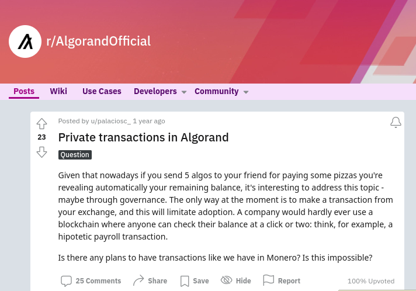
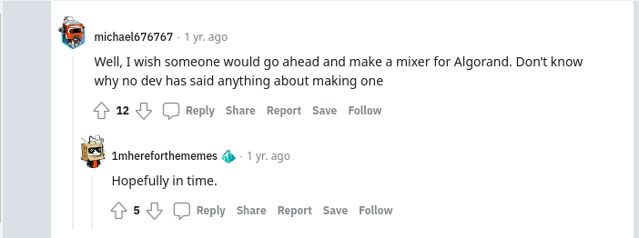
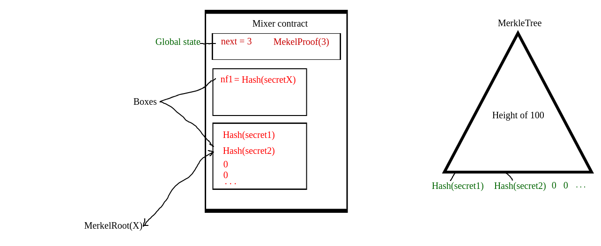

# CoinFog

CoinFog is an Algorand-based privacy tool that allows users to make anonymous transactions on the blockchain.
It does this by implementing a "mixer" service.

Mixers are tools that can be used to obscure the origin and destination of funds.
They do this by taking in a large number of transactions from different users and outputting a similar number of transactions to different addresses.
This makes it difficult for someone to trace the origin or destination of a particular transaction.

## Uses

CoinFog allows users to access decentralized applications (dApps) with greater privacy and security.
Purpose of this platform is for:

1. **Increased financial privacy**: to obscure the flow of funds between different addresses, making it more difficult for others to track an individual's or business's financial activity from prying eyes.
2. **Avoidance of censorship**: to bypass censorship attempts by centralized entities.
3. **Protection against surveillance**: another layer of secrecy against surveillance by centralized agencies or other entities, helping to preserve privacy and autonomy.
4. **Hiding Business Expenses**: Businesses can keep their expenses private and protected, such as medical expenses and anonymous donations
without fear of their information being leaked.

## Features

In the case of Mixers, zero-knowledge proofs are used to ensure that the mixer service cannot link a user's input to their output.
This is done by allowing users to prove that they own a certain amount of funds without revealing which specific funds they are using.
The current version of CoinFog does not yet include the implementation of zk-proofs.
However, the team is working on incorporating this feature into the platform.
The implementation of zk-proofs will enhance the security and privacy of the transactions made on CoinFog.

CoinFog has the following features on frontend:

- user-friendly and visually appealing UI/UX design.
- visual cues that deposit and withdrawal transactions have been detached.
- allows users to connect to the frontend through various types of wallets.
- frontend deployed on [Fleek (IPFS)](https://coinfog.on.fleek.co/), which means that users can run their own instance and bypass censorship efforts.
  Also on [Vercel](https://coinfog.vercel.app/) for the OG's.


## Motivation

https://www.reddit.com/r/AlgorandOfficial/comments/prs7b8/private_transactions_in_algorand/



## Installation

Clone the [repository](https://github.com/Adg0/CoinFog) and follow follow this steps:

```console
$ git clone git@github.com:Adg0/CoinFog.git
$ cd CoinFog
$ mv .env.example .env
$ vim .env
// change variables
$ pip install -r requirements.txt
```

## Compatibility

CoinFog is compatible with the following wallets:

- Pera
- Exodus
- DeFly
- AlgoSigner
- MyAlgoWallet
- WalletConnect

## Tech Stack

CoinFog is built with the following technologies:

- PyTeal: PyTeal is used to implement smart contracts.

- Python AlgoSdk: Python AlgoSdk is used to interact with the Algorand network.

- NextJS: NextJS is used for the frontend framework.

- TailwindCss: Tailwind is used for styling the application.

- Fleek: Fleek is used for hosting the application.


## Architecture



Depositor makes a deposit with app call to mixer contract. That is making a deposit of 5 Algos.

Withdrawal calls are made from a relay to preserve anonymity.
The relay is built as delegated contract; that is a smart signature.
A relay is used to break link to new account.

Safety is taken to protect relay delegation; that is

1. Rekey check
2. Fee check
3. Allows only application calls, specifically to mixer app
4. On-completion is restricted to NoOp; because malicious actors might attack the relay by calling clearState on-completion and drain the funds of relay address.

### Depositing

Verify call sent is sent with 5 Algos, in atomic transction to pool.

Global state `next` is incremented

`Hash(secretX, nullfier)` is added to hash box

`MerkleProof(next)` is calculated

Global state `MerkelProof` is updated with MerkleProof(next) calculated value.

### Withdrawing

Password is sent as argument, example: `secretP, nullifier`.

Search nullifer box that no entry for `Hash(nullifierP)` is available.

Search hash box that their exsists `Hash(secretP)`

Update nullifier box by adding entry `Hash(nullifierP)`

Send Atomic transaction with:

```
Txn.account[0] gets 100k microAlgo: that is the relay fee, anyone can create another relay to collect relay fees
Txn.account[1] gets 5 Algo - relayFee - mixerFee
```

### Profit

Last part is taking profit from mixer contract.
And the creator address can withdraw profits made, which is the `mixerFee` deducted when depositors withdraw their balance.

## Support

For support, please open an issue on the [repository](https://github.com/Adg0/CoinFog/issues).

## Contribution

We welcome contributions to the CoinFog project.
If you are interested in contributing, please open a pull request on the [repository](https://github.com/Adg0/CoinFog/pulls).

## License

CoinFog is open-source software licensed under the [MIT license](https://github.com/Adg0/CoinFog/blob/main/LICENSE).

:warning: _Please note that CoinFog is a proof of concept, not to be used in production environment._

## ToDo

- [x] Relay
- [x] Relay test
- [x] Mixer contract
- [x] Mixer test
- [x] Frontend wallet connect
- [x] Documentation
- [ ] Presentation
